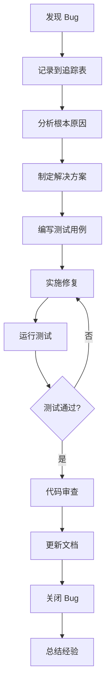

# Bug 追踪模板 / Bug Tracking Template

> 用于记录和追踪开发过程中遇到的 Bug，形成个人错题集，避免重复犯错
> For tracking bugs encountered during development, creating a personal error collection to avoid repeated mistakes

## 📊 Bug 追踪表格模板 / Bug Tracking Table Template

| ID | 日期 Date | 模块 Module | 严重程度 Severity | 问题描述 Description | 根本原因 Root Cause | 解决方案 Solution | 预防措施 Prevention | 相关代码 Related Code | 状态 Status |
|:---|:---|:---|:---|:---|:---|:---|:---|:---|:---|
| B001 | 2024-01-15 | 登录模块 | 高 High | 特殊字符导致崩溃 | 未验证输入 | 添加输入验证 | 所有输入都需验证 | LoginViewController.swift:45 | ✅ 已修复 |
| B002 | 2024-01-16 | 网络请求 | 中 Medium | 内存泄漏 | 循环引用 | 使用 weak self | 闭包都要检查引用 | NetworkManager.swift:78 | ✅ 已修复 |
| B003 | 2024-01-17 | UI更新 | 高 High | UI 不更新 | 后台线程更新 | 主线程更新 | UI 操作都在主线程 | HomeView.swift:123 | ✅ 已修复 |

## 📝 详细记录模板 / Detailed Record Template

```markdown
## Bug #[编号]

### 基本信息 / Basic Information
- **发现日期 / Date Found**: YYYY-MM-DD
- **修复日期 / Date Fixed**: YYYY-MM-DD
- **发现者 / Found By**: [姓名]
- **修复者 / Fixed By**: [姓名]
- **影响版本 / Affected Version**: [版本号]
- **修复版本 / Fixed Version**: [版本号]

### 问题描述 / Problem Description
[详细描述问题的表现，包括复现步骤]
[Detailed description of the issue, including reproduction steps]

### 复现步骤 / Reproduction Steps
1. 
2. 
3. 

### 期望结果 / Expected Result
[应该发生什么]

### 实际结果 / Actual Result
[实际发生了什么]

### 根本原因分析 / Root Cause Analysis
[深入分析为什么会出现这个问题]

### 解决方案 / Solution
```swift
// 错误代码 / Incorrect Code
[错误的代码示例]

// 正确代码 / Correct Code
[修复后的代码]
```

### 影响范围 / Impact Scope
- [ ] 数据丢失 / Data Loss
- [ ] 功能失效 / Feature Failure
- [ ] 性能问题 / Performance Issue
- [ ] 安全问题 / Security Issue
- [ ] 用户体验 / User Experience

### 测试验证 / Test Verification
- [ ] 单元测试 / Unit Test
- [ ] 集成测试 / Integration Test
- [ ] UI 测试 / UI Test
- [ ] 手动测试 / Manual Test

### 预防措施 / Prevention Measures
1. [如何避免类似问题]
2. [需要添加的检查]
3. [流程改进建议]

### 相关链接 / Related Links
- Pull Request: #
- Issue: #
- 测试用例 / Test Case: 
- 文档 / Documentation: 

### 经验教训 / Lessons Learned
[从这个 Bug 中学到了什么]
```

## 🏷️ Bug 分类系统 / Bug Classification System

### 按严重程度 / By Severity
- 🔴 **严重 (Critical)**: 导致崩溃或数据丢失
- 🟠 **高 (High)**: 主要功能失效
- 🟡 **中 (Medium)**: 次要功能问题
- 🟢 **低 (Low)**: 界面或体验问题

### 按类型 / By Type
- **崩溃 (Crash)**: 应用程序崩溃
- **逻辑错误 (Logic Error)**: 业务逻辑错误
- **性能问题 (Performance)**: 响应缓慢或卡顿
- **内存问题 (Memory)**: 内存泄漏或过度使用
- **UI 问题 (UI)**: 界面显示异常
- **兼容性 (Compatibility)**: 版本或设备兼容问题
- **安全问题 (Security)**: 安全漏洞

### 按模块 / By Module
- **网络层 (Network Layer)**
- **数据层 (Data Layer)**
- **业务逻辑 (Business Logic)**
- **UI 层 (UI Layer)**
- **工具类 (Utilities)**

## 📈 Bug 统计分析 / Bug Statistics Analysis

### 月度统计模板 / Monthly Statistics Template

| 月份 Month | 新增 New | 修复 Fixed | 待修复 Pending | 严重 Critical | 高 High | 中 Medium | 低 Low |
|:---|:---:|:---:|:---:|:---:|:---:|:---:|:---:|
| 2024-01 | 15 | 12 | 3 | 2 | 5 | 6 | 2 |
| 2024-02 | 10 | 11 | 2 | 1 | 3 | 4 | 2 |
| 2024-03 | 8 | 9 | 1 | 0 | 2 | 5 | 1 |

### 趋势分析 / Trend Analysis
- Bug 数量趋势
- 最常见的 Bug 类型
- 最容易出问题的模块
- 平均修复时间

## 🔍 常见 Bug 检查清单 / Common Bug Checklist

### Swift/iOS 特定 / Swift/iOS Specific

#### 内存管理 / Memory Management
- [ ] 检查循环引用 (weak/unowned)
- [ ] 检查闭包捕获
- [ ] 检查 Timer 释放
- [ ] 检查通知中心移除
- [ ] 检查 KVO 移除

#### 线程安全 / Thread Safety
- [ ] UI 更新在主线程
- [ ] 数据竞争检查
- [ ] 死锁风险评估
- [ ] 异步回调处理

#### 可选值处理 / Optional Handling
- [ ] 避免强制解包
- [ ] 使用 guard let
- [ ] 使用 if let
- [ ] 使用 nil 合并运算符

#### 集合操作 / Collection Operations
- [ ] 数组越界检查
- [ ] 字典键值存在性
- [ ] 空集合处理
- [ ] 并发修改检查

## 🎯 Bug 修复流程 / Bug Fix Workflow



## 💡 Bug 预防最佳实践 / Bug Prevention Best Practices

### 1. 编码阶段 / Coding Phase
- 使用 SwiftLint 静态检查
- 编写单元测试
- 代码审查
- 结对编程

### 2. 测试阶段 / Testing Phase
- 自动化测试
- 边界值测试
- 异常流程测试
- 性能测试

### 3. 部署阶段 / Deployment Phase
- 灰度发布
- 监控告警
- 崩溃收集
- 用户反馈

## 📚 学习资源 / Learning Resources

### Bug 分析工具 / Bug Analysis Tools
- **Crashlytics**: 崩溃分析
- **Bugsnag**: 错误监控
- **Sentry**: 异常追踪
- **AppCenter**: 诊断服务

### 推荐阅读 / Recommended Reading
- 《代码大全》- 错误处理章节
- 《重构》- 代码坏味道
- 《Effective Swift》- 最佳实践
- 《iOS 应用逆向工程》- 调试技巧

## 📊 Excel 模板说明 / Excel Template Instructions

创建 Excel 文件时，建议包含以下工作表：

### Sheet 1: Bug 列表 / Bug List
- 所有 Bug 的主列表
- 包含筛选和排序功能
- 状态颜色标记

### Sheet 2: 统计分析 / Statistics
- 自动统计图表
- 趋势分析
- 模块分布

### Sheet 3: 经验总结 / Lessons Learned
- 每个 Bug 的关键教训
- 预防措施清单
- 最佳实践更新

### Sheet 4: 检查清单 / Checklist
- 代码审查清单
- 测试清单
- 发布前检查清单

---

## 使用建议 / Usage Suggestions

1. **坚持记录**: 每个 Bug 都要记录，无论大小
2. **及时更新**: 修复后立即更新状态
3. **定期回顾**: 每周/月回顾错题集
4. **分享经验**: 团队内分享典型案例
5. **持续改进**: 根据统计优化流程

> "那些不记得过去的人注定要重复过去的错误。"
> "Those who cannot remember the past are condemned to repeat it."

---

*Template Version: 1.0.0*
*Last Updated: 2024*